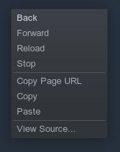
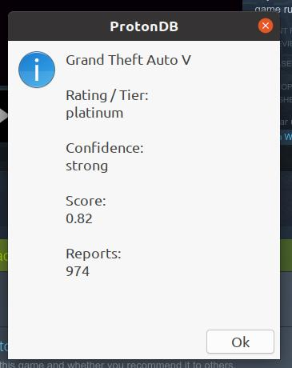

# autokey_steamtools
Scripts for Autokey

- steamtools script: https://github.com/thingsiplay/autokey_steamtools
- Autokey is required: https://github.com/autokey/autokey/

You need to install Autokey first. Then copy the script proton.py and its settings file .proton.json (files starting with . are hidden, so careful) from autokey_steamtools into Autokeys scripts folder. Subfolders can be created too. Location on my system:
    
        /home/tuncay/.config/autokey/data/

 

## Script: proton.py

Simple script for Autokey. Running the script will lookup game id and display a dialog with ProtonDB rating and open the corresponding page of ProtonDB. The script only works in Steam client at the games shop page. If default hotkey is working, then 'F6' will activate the script.

When activated, the script will perform a right mouse click and go through the menu to copy the url into clipboard. Then the game ID will be extracted and link to ProtonDB page created. A dialog with summary information and a rating is displayed. After clicking okay the ProtonDB page will open in browser.

The default hotkey is 'F6', but can be changed in Autokey itself. If you do not want to show up the dialog or open the link in browser, then edit the scripts variables.

Set variables

	ACTION_DIALOG=False
	
to disable show dialog or

	ACTION_WEBBROWSER=False 

to disable open browser. Values set to *True* will enable again.
